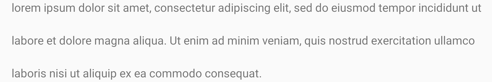

[](https://jitpack.io/#hitanshu-dhawan/SpannableStringParser)
[](https://circleci.com/gh/hitanshu-dhawan/SpannableStringParser)
[](https://www.codacy.com/manual/hitanshu-dhawan/SpannableStringParser?utm_source=github.com&amp;utm_medium=referral&amp;utm_content=hitanshu-dhawan/SpannableStringParser&amp;utm_campaign=Badge_Grade)
[](https://codecov.io/gh/hitanshu-dhawan/SpannableStringParser)
<br>
[](http://androidweekly.net/issues/issue-396)

In Android, to style our text we use Spans.
<br>
Spans are markup objects that can be applied to parts of the text.

It requires us to deal with the indexes of the text that we want to style.

```kotlin
val string = SpannableString("Text with a foreground color span")
string.setSpan(ForegroundColorSpan(Color.RED), 12, 28, Spanned.SPAN_EXCLUSIVE_EXCLUSIVE)
```

But what if the text is dynamic and the styling of the text is also dynamic.
<br>
Now, dealing with indexes and styling becomes really difficult for us.

This is where <b>SpannableStringParser</b> helps us.
<br>
You can specify which text to style and how to style them inside the string itself, and use the `spannify()` extension function to style it.

```kotlin
val string = "Text with a { `foreground color` < text-color:#FF0000 /> } span".spannify()
```

This string can also come from a back-end server and if we wish to change the style of the text in future, the string can be easily changed from back-end and no front-end change will be required.

<b>SpannableStringParser</b> internally uses `Spannable`, which is more performant than `Html`.

## Have a Look

#### 1. Text having a property
```kotlin
"Hello { `SpannableStringParser` < text-color:#0000FF /> }"
```

---
#### 2. Text having multiple properties
```kotlin
"Hello { `SpannableStringParser` < text-color:#0000FF ; text-decoration:underline /> }"
```

---
#### 3. Text having multiple properties with multiple values
```kotlin
"Hello { `SpannableStringParser` < text-color:#0000FF ; text-decoration:underline|strike-through /> }"
```


## Usage

- Syntax for "text" having a property
```kotlin
text_view.text = "{ `text` < property:value /> }".spannify()
```

- Syntax for "text" having multiple properties
```kotlin
text_view.text = "{ `text` < property:value ; property:value /> }".spannify()
```

- Syntax for "text" having multiple properties with multiple values
```kotlin
text_view.text = "{ `text` < property:value ; property:value|value /> }".spannify()
```

- You can even add custom properties using the `spanner` method.
```kotlin
spanner { property, value ->
    when (property) {
        "..." -> {
            if (value == "...")
                return@spanner Custom1Span()
        }
        "..." -> {
            if (value == "...")
                return@spanner Custom2Span()
        }
    }
    return@spanner null
}
```

## Supported Properties

### `text-color`
- The `text-color` property specifies the color of text.

```kotlin
"Hello { `World` < text-color:#FF00FF /> }"
```


```kotlin
"Hello { `World` < text-color:#44FF00FF /> }"
```


---

### `background-color`
- The `background-color` property specifies the background color of text.

```kotlin
"Hello { `World` < background-color:#FF00FF /> }"
```


```kotlin
"Hello { `World` < background-color:#44FF00FF /> }"
```


---

### `line-background-color`
- The `line-background-color` property specifies the background color of lines.

```kotlin
"Hello { `World` < line-background-color:#FF00FF /> }"
```


```kotlin
"Hello { `World` < line-background-color:#44FF00FF /> }"
```


---

### `text-size`
- The `text-size` property sets the size of text.

```kotlin
"Hello { `World` < text-size:24dp /> }"
```


```kotlin
"Hello { `World` < text-size:2.4em /> }"
```


```kotlin
"Hello { `World` < text-size:24px /> }"
```


---

### `text-decoration`
- The `text-decoration` property sets the kind of text decoration to use (like underline, strike-through).

```kotlin
"Hello { `World` < text-decoration:underline /> }"
```


```kotlin
"Hello { `World` < text-decoration:strike-through /> }"
```


---

### `subscript`
- The `subscript` property defines subscript text.

```kotlin
"Hello { `World` < subscript:true /> }"
```


---

### `superscript`
- The `superscript` property defines superscript text.

```kotlin
"Hello { `World` < superscript:true /> }"
```


---

### `text-style`
- The `text-style` property specifies the style of text.

```kotlin
"Hello { `World` < text-style:normal /> }"
```


```kotlin
"Hello { `World` < text-style:bold /> }"
```


```kotlin
"Hello { `World` < text-style:italic /> }"
```


---

### `font-family`
- The `font-family` property specifies the font of text.

```kotlin
"Hello { `World` < font-family:monospace /> }"
```


```kotlin
"Hello { `World` < font-family:serif /> }"
```


```kotlin
"Hello { `World` < font-family:sans-serif /> }"
```


---

### `text-alignment`
- The `text-alignment` property specifies the alignment of text.

```kotlin
"{ `Hello World` < text-alignment:normal /> }"
```


```kotlin
"{ `Hello World` < text-alignment:opposite /> }"
```


```kotlin
"{ `Hello World` < text-alignment:center /> }"
```


---

### `line-height`
- The `line-height` property specifies the height of line.

```kotlin
val lorem_ipsum = "lorem ipsum ..."
"{ `${lorem_ipsum}` < line-height:120px /> }"
```


---

### `url`
- The `url` property specifies the url for text, clicking on which will open the url.

```kotlin
"Click { `here` < url:`https://www.google.com` /> } for more information"
```


> note: place set textview `movementMethod` first ,just like this: `text_view.movementMethod = LinkMovementMethod.getInstance()`

---

### `more-properties-coming-soon`
You can add your custom properties using the `spanner` method.
<br>
But! If you want any property to be added in SpannableStringParser, feel free to open issues/pull requests.

## Download
Add JitPack repository to your root `build.gradle` file
```
allprojects {
    repositories {
        maven { url 'https://jitpack.io' }
    }
}
```
Add the dependency to your app `build.gradle` file
```
dependencies {
    implementation 'com.github.hitanshu-dhawan:SpannableStringParser:1.1.0'
}
```

## Licence
```
Copyright (c) 2019 Hitanshu Dhawan

Licensed under the Apache License, Version 2.0 (the "License");
you may not use this file except in compliance with the License.
You may obtain a copy of the License at

http://www.apache.org/licenses/LICENSE-2.0

Unless required by applicable law or agreed to in writing, software
distributed under the License is distributed on an "AS IS" BASIS,
WITHOUT WARRANTIES OR CONDITIONS OF ANY KIND, either express or implied.
See the License for the specific language governing permissions and
limitations under the License.
```
